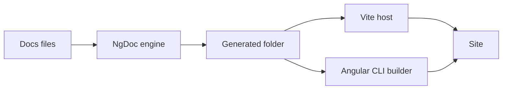

The new engine runs in one of two hosts: the Vite host or an Angular CLI builder. Both generate the
same site. This page helps you choose, and shows how each one runs in development and production.

<ng-doc-blockquote type="note" label="🧭 New or existing project?">

A new standalone application gets the Vite host from `ng add` (`*InstallationPage`). `ng update`
keeps existing projects on the legacy builders; for them, the new engine is opt-in: see
`*MigrateToNewEnginePage`. The legacy builders are described in `*LegacyBuildersPage`.

</ng-doc-blockquote>

## 🆚 Choose a host

|            | Vite host                                                                      | Angular CLI builder                                                 |
| ---------- | ------------------------------------------------------------------------------ | ------------------------------------------------------------------- |
| Role       | Recommended, full support                                                      | A thin compatibility path                                           |
| Set up by  | `ng add`, `ng g @ng-doc/builder:migrate-to-vite`, or by hand (`*ViteHostPage`) | The `modern-*` builders (`*BuildersReference#angular-cli-builders`) |
| Dev        | `vite`, or `ng serve` with a Vite builder                                      | `ng serve`                                                          |
| Production | `vite build`; prerender with `ng build`                                        | `ng build`                                                          |
| SSR        | Development renders in the browser; production prerenders every route          | Angular SSR                                                         |
| Platforms  | Linux, macOS and Windows                                                       | Linux, macOS and Windows                                            |

Choose the **Vite host** for new projects and for the fastest edit loop. Choose the **Angular CLI
builder** to keep an existing `angular.json` or `project.json` setup with fewer changes. It runs
Angular's own builders once the documentation is generated, so after an edit it waits for Angular
to rebuild the application.

## How the hosts run



In both hosts, the engine writes the generated folder first. Then the host compiles the Angular
application, which imports the generated code from `@ng-doc/generated`.

In development, the engine keeps a compiler worker running between edits. When you save a file, it
rebuilds only the pages that depend on it, and the host updates the page in the browser.

## The `ng-doc` command

The `ng-doc` command runs the engine without Angular CLI or Vite. Use it in scripts, or to put
NgDoc in front of another development server:

```bash
ng-doc generate --project <project-name>
ng-doc dev --project <project-name> -- <dev-server-command>
```

`generate` builds the documentation once. `dev` builds it, watches your files, and starts the
command after `--` once the first build is ready. When `dev` stops, it stops the command and every
process the command started. On Windows, `ng`, `npm` and `npx` run through Node. Any other `.cmd`
or `.bat` command runs through `cmd.exe`, which can't pass an argument containing `"`, `%`, `!` or a
line break safely, so `dev` refuses one. `*BuildersReference#command-line-interface` lists every
flag.

## If something misbehaves

The new engine has environment switches that turn off one optimization each, such as the
long-running compiler worker. If a page doesn't update or a build fails only in development, try
the switches to find the cause. `*TroubleshootingPage` shows how, and `*BuildersReference` lists
them.



## Related

- `*ViteHostPage`
- `*ProductionBuildsPage`
- `*PerformanceAndCachingPage`
- `*BuildersReference`



Next: `*ViteHostPage`
