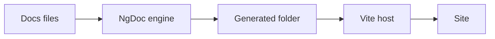

The new engine runs in the Vite host: Vite builds and serves the Angular application, and NgDoc
generates the documentation inside it. This page compares it with the legacy builders, and shows how
it runs in development and production.

<ng-doc-blockquote type="note" label="🧭 New or existing project?">

A new standalone application gets the Vite host from `ng add` (`*InstallationPage`). `ng update`
keeps existing projects on the legacy builders; for them, the new engine is opt-in: see
`*MigrateToNewEnginePage`. The legacy builders are described in `*LegacyBuildersPage`.

</ng-doc-blockquote>

## New engine or legacy builders

|               | Vite host (new engine)                                                         | Legacy builders                                             |
| ------------- | ------------------------------------------------------------------------------ | ----------------------------------------------------------- |
| Status        | Recommended, full support                                                      | Deprecated in 22.0, no new features                         |
| Set up by     | `ng add`, `ng g @ng-doc/builder:migrate-to-vite`, or by hand (`*ViteHostPage`) | `ng update` keeps them; `ng add --engine legacy`            |
| Builders      | `@ng-doc/builder:vite-dev-server`, `@ng-doc/builder:vite-application`          | `@ng-doc/builder:dev-server`, `@ng-doc/builder:application` |
| Dev           | `vite`, or `ng serve` with `vite-dev-server`                                   | `ng serve`                                                  |
| Production    | `vite build`; server bundle and prerender with `ng build` (`vite-application`) | `ng build`                                                  |
| SSR           | Development renders in the browser; production prerenders every route          | Angular SSR                                                 |
| `onlyForTags` | Honoured (`*PagesAndCategoriesPage#build-tags`)                                | Ignored                                                     |
| Platforms     | Linux, macOS and Windows                                                       | Linux, macOS and Windows                                    |

Use the **Vite host** for new projects. To move a project off the legacy builders, run
`ng g @ng-doc/builder:migrate-to-vite` (`*MigrateToNewEnginePage`).

## How the new engine runs



The engine writes the generated folder first. Then Vite compiles the Angular application, which
imports the generated code from `@ng-doc/generated`. The Vite builders run the same Vite
configuration for `ng serve` and `ng build` (`*BuildersReference#vite-builders`).

In development, the engine keeps a compiler worker running between edits. When you save a file, it
rebuilds only the pages that depend on it, and the host updates the page in the browser.

## The `ng-doc` command

The `ng-doc` command runs the engine without Angular CLI or Vite. Use it in scripts, or to put
NgDoc in front of another development server:

```bash
ng-doc generate --project <project-name>
ng-doc dev --project <project-name> -- <dev-server-command>
```

`generate` builds the documentation once. `dev` builds it, watches your files, and starts the
command after `--` once the first build is ready. When `dev` stops, it stops the command and every
process the command started. On Windows, `ng`, `npm` and `npx` run through Node. Any other `.cmd`
or `.bat` command runs through `cmd.exe`, which can't pass an argument containing `"`, `%`, `!` or a
line break safely, so `dev` refuses one. `*BuildersReference#command-line-interface` lists every
flag.

## If something misbehaves

The new engine has environment switches that turn off one optimization each, such as the
long-running compiler worker. If a page doesn't update or a build fails only in development, try
the switches to find the cause. `*TroubleshootingPage` shows how, and `*BuildersReference` lists
them.



## Related

- `*ViteHostPage`
- `*ProductionBuildsPage`
- `*PerformanceAndCachingPage`
- `*BuildersReference`



Next: `*ViteHostPage`
