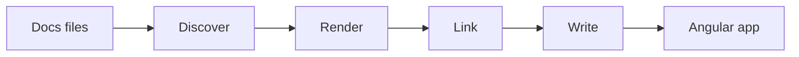

👋 Welcome! NgDoc turns an Angular application into a documentation site for your components and
APIs. You write guide pages in Markdown next to your code, and NgDoc adds live demos, playgrounds,
API pages, links and search. It is built for authors of Angular libraries and design systems.

## ✨ What NgDoc can do

| Feature     | What you get                                                                   | Learn more              |
| ----------- | ------------------------------------------------------------------------------ | ----------------------- |
| Demos       | Any Angular component rendered on the page, with its source code in tabs.      | `*DemosPage`            |
| Playgrounds | Controls for a component's inputs, so readers can try every option.            | `*PlaygroundsPage`      |
| API pages   | A page for every exported class, function, interface and type in your sources. | `*GenerateApiPagesPage` |
| Keywords    | Inline code such as `NgDocPage` becomes a link to its API page or guide page.  | `*LinksAndKeywordsPage` |
| Code blocks | Named files, code groups, highlighted lines and code embedded from real files. | `*CodeBlocksPage`       |
| Diagrams    | Mermaid diagrams written as plain text.                                        | `*DiagramsPage`         |
| Search      | Full-text search over guide pages and API pages.                               | `*SearchPage`           |
| Theming     | Light, dark and custom themes through CSS variables.                           | `*ThemesAndColorsPage`  |

## 👀 See it

This is a demo. NgDoc renders the component and shows its source code in tabs:

{{ NgDocActions.demo("BadgeDemoComponent") }}

This is a playground for the same component. Change the values of its controls to update the preview:

{{ NgDocActions.playground("BadgePlayground") }}

Both come from a few lines in the page configuration. The `*YourFirstPage` tutorial builds them
step by step.

## How it fits together

NgDoc reads your documentation files, renders them into Angular code and writes that code into a
generated folder. Your Angular application imports the generated routes and serves the site.

`*HowNgDocWorksPage` explains each step.

## Why NgDoc

Good documentation combines guides with examples and an API reference that stays in sync with the
code. NgDoc keeps all three in one Angular application: guide pages link to API pages, API pages
link back, and demos run the real components.

## 🚀 Start here

1. `*InstallationPage`: add NgDoc to an Angular application.
2. `*YourFirstPage`: write a page with a demo, a playground and an API link.

Next: `*InstallationPage`
