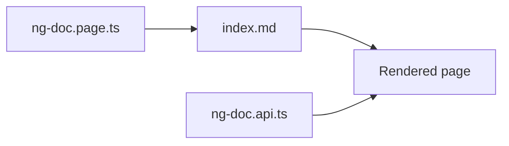
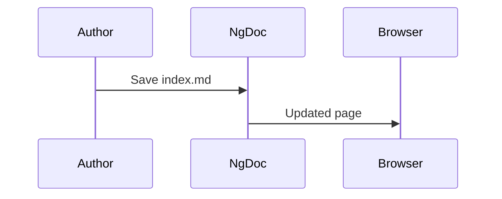

Draw flowcharts, sequence diagrams and other charts from plain text with `mermaid`. The diagram
source stays in the Markdown file, so it is easy to review and update.

## 👀 See it



## 🧰 Use it

Diagrams are off by default because the Mermaid library is large. Add `provideMermaid()` to the
providers of your application:

```typescript name="app.config.ts" {2,6}
import { ApplicationConfig } from '@angular/core';
import { provideMermaid } from '@ng-doc/app';

export const appConfig: ApplicationConfig = {
  providers: [
    provideMermaid(),
    // ...the other NgDoc providers
  ],
};
```

Then write a code block with the `mermaid` language:

````markdown name="index.md"

````

## 📋 Options

`provideMermaid` accepts a Mermaid configuration object and passes it to Mermaid's `initialize()` function.
NgDoc renders diagrams itself, so it always sets `startOnLoad` to `false`.

```typescript name="app.config.ts"
provideMermaid({ theme: 'neutral' });
```

## Sequence diagrams

````markdown name="index.md"

````


## 🚧 Gotchas

> **Warning**
> Without `provideMermaid()`, a page with a `mermaid` block throws the error "Mermaid is not
> provided" when the page renders, and the diagram doesn't appear.



## Related

- `*CodeBlocksPage`
- `*AppProvidersReference`



Next: `*LinksAndKeywordsPage`
