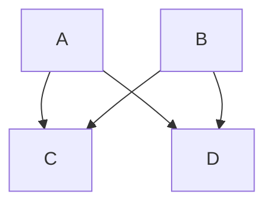
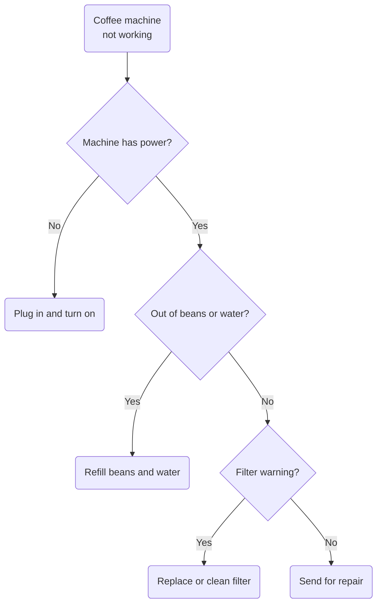

# Section

nnn

`*AnotherPage`
`*AnotherApiPage`
123
qwe
sd
we
123

`*AnotherPage#section1`

```mermaid
graph TB
    A & B--> C & D
```

```mermaid
graph TD
   A(Coffee machine <br>not working) --> B{Machine has power?}
   B -->|No| H(Plug in and turn on)
   B -->|Yes| C{Out of beans or water?} -->|Yes| G(Refill beans and water)
   C -->|No| D{Filter warning?} -->|Yes| I(Replace or clean filter)
   D -->|No| F(Send for repair)

```

{{ NgDocActions.demo("DemoComponent") }}
